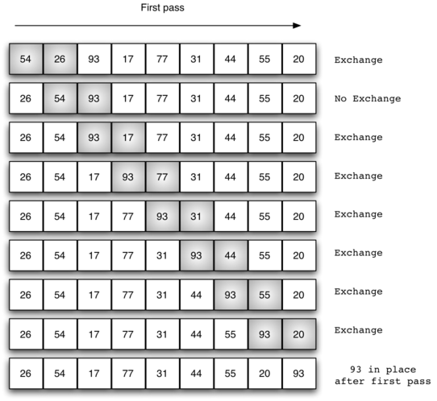

# Bubble Sort - Breve explicação

O **bubble sort** realiza múltiplas passagem por uma lista. Ele compara itens adjacentes e troca aqueles que estão fora de ordem. Cada passagem pela lista coloca o próximo maior valor na sua posição correta. Em essência, cada item se desloca como uma “bolha” para a posição à qual pertence.

A figura à seguir mostra a primeira passagem de um bubble sort. Os itens sombreados são aqueles que estão sendo comparados para verificar se estão fora de ordem. Se existem `n` itens na lista, então existem `n−1` pares de itens que precisam ser comparados na primeira passagem. É importante observar que o maior valor na lista esteja em alguma comparação, ele será continuamente empurrado até o fim da passagem.



No começo da segunda passagem, o maior valor agora está ordenado. Ainda existem `n−1` itens para serem ordenados, o que significa que teremos `n−2` pares de comparação. Como cada passagem colocar o próximo maior valor encontrado no lugar certo, o número total de passagens necessárias será `n−1`. Depois de completar `n−1` passagens, o menor item estará na posição correta e nenhum processamento adicional será necessário.

Então, resumindo:

- Ele compara pares de elementos **adjacentes**.

- Se o elemento atual for maior que o próximo, eles são **trocados**.

- Repete o processo até que nenhuma troca seja necessária em uma passagem completa.

## Operação de Troca

A operação de troca de dois elementos em uma lista requer o uso de uma variável para armazenamento temporário. Como pode ser visto no trecho de código abaixo:

>```c++
>temp = arr[j];
>arr[j] = arr[j + 1];
>arr[j + 1] = temp;
>```

Nesse trecho de código, ele irá trocar os i-ésimos com os j-ésimos itens na lista. Sem a variável de armazenamento temporário, um dos valores seria sobrescrito.

## Funcionamento

A animação abaixo mostra o `bubbleSort` em ação.


## Vantagens e Desvantagens

| Vantagens                                | Desvantagens                           |
|------------------------------------------|----------------------------------------|
| ✔ Simples de implementar.                | ✖ Ineficiente para grandes datasets.   |
| ✔ Estável. | ✖ Complexidade O(n²) no pior caso.     |
| ✔ In-place (não usa memória extra).      | ✖ Pouco usado na prática.              |

## Desempenho

- Melhor Caso (já ordenado): O(n).

- Pior Caso (inverso): O(n²).

- Caso Médio: O(n²).

## Quando Usar?

- Listas pequenas (até ~1000 elementos).

- Fins educativos (para ensinar ordenação básica).

- Ambientes com restrições de memória (in-place).

## Referências

[Bubble Sort - USP](https://panda.ime.usp.br/panda/static/pythonds_pt/05-OrdenacaoBusca/OBubbleSort.html#lst-bubble)
