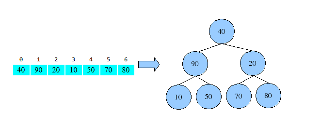

# Heap Sort - Breve explicação

O heapsort utiliza uma estrutura de dados chamada heap, para ordenar os elementos à medida que os insere na estrutura. Assim, ao final das inserções, os elementos podem ser sucessivamente removidos da raiz da heap, na ordem desejada, lembrando-se sempre de manter a propriedade de max-heap.

A heap pode ser representada como uma árvore (uma árvore binária) ou como um vetor. Para uma ordenação decrescente, deve ser construída uma heap mínima (o menor elemento fica na raiz). Para uma ordenação crescente, deve ser construído uma heap máxima (o maior elemento fica na raiz).

Representação do heap:

O heap é gerado e mantido no próprio vetor a ser ordenado.

O algoritmo funciona dividindo o array em uma partição ordenada e outra não-ordenada, convertendo a parte não-ordenada em um heap máximo (max-heap) e extraindo o maior elemento repetidamente para a partição ordenada.

## Explicação do Algoritmo

1. **Construir um Heap Máximo:**

    - Transforma o array em um heap máximo, onde cada nó pai é maior que seus filhos.

2. **Extrair Máximo e Reorganizar:**

    - Remove o maior elemento (raiz) e coloca no final do array.

    - Reorganiza o heap para manter a propriedade máxima.

3. **Repetir:**

    - Continua extraindo o maior elemento até que todo o array esteja ordenado.

## Funcionamento

A animação abaixo mostra o `heapSort` em ação.

## Vantagens e Desvantagens

| Vantagens                                       | Desvantagens                                             |
|------------------------------------------------|----------------------------------------------------------|
| ✔ Eficiente: Sempre O(n log n).                | ✖ Não estável: Pode alterar ordem de elementos iguais.   |
| ✔ In-place: Não usa memória extra.             | ✖ Mais lento na prática que Quick Sort e Merge Sort.     |
| ✔ Bom para estruturas de dados externas.       | ✖ Complexo de implementar.                               |

## Desempenho

| Caso         | Complexidade | Quando Ocorre?                                                                                      |
|--------------|--------------|-----------------------------------------------------------------------------------------------------|
| Melhor Caso  | O(n log n)   | Quando o array já está ordenado (mesmo assim, o algoritmo precisa construir o heap e extrair os elementos). |
| Pior Caso    | O(n log n)   | Quando o array está inversamente ordenado (o heap ainda requer as mesmas comparações e trocas).    |
| Caso Médio   | O(n log n)   | Para dados aleatórios ou parcialmente ordenados.                                                   |

### Por Que Sempre O(n log n)?

1. **Construção do Heap Máximo:**

    - Leva O(n) para transformar o array em um heap.

2. **Extração dos Elementos:**

    - Cada extração do maior elemento (raiz) e reorganização do heap leva O(log n).

    - Como isso é repetido n–1 vezes, a complexidade total é O(n log n).

## Quando Usar?

- Quando não se pode usar recursão (evita estouro de pilha).

- Em sistemas embarcados ou com memória limitada (in-place).

## Referências

[Heap Sort - Wkipédia](https://pt.wikipedia.org/wiki/Heapsort#cite_note-2)
[Heap Sort - UFRJ](https://www.cos.ufrj.br/~rfarias/cos121/aula_09.html)