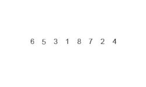

# Merge Sort - Breve explicação

O **merge sort**, um algoritmo recursivo que divide uma lista continuamente pela metade. Se a lista estiver vazia ou tiver um único item, ela está ordenada por definição (o caso base). Se a lista tiver mais de um item, dividimos a lista e invocamos recursivamente um merge sort em ambas as metades. Assim que as metades estiverem ordenadas, a operação fundamental, chamada de **intercalação**, é realizada. Intercalar é o processo de pegar duas listas menores ordenadas e combiná-las de modo a formar uma lista nova, única e ordenada. A Figura à seguir mostra uma lista sendo dividida pelo `mergeSort`.

Conceitualmente, uma ordenação por `mergeSort` funciona da seguinte maneira:

- Divida a lista não classificada em n sublistas, cada uma contendo um elemento (uma lista de um elemento é considerada classificada).
- Mescle sublistas repetidamente para produzir novas sublistas ordenadas até que reste apenas uma sublista. Esta será a lista ordenada.

## Funcionamento

A animação abaixo mostra o `mergeSort` em ação.

## Vantagens e Desvantagens

| Vantagens                                         | Desvantagens                                        |
|--------------------------------------------------|-----------------------------------------------------|
| ✔ Estável: Mantém a ordem de elementos iguais.   | ✖ Uso de memória auxiliar: O(n) para arrays.        |
| ✔ Eficiente: Sempre O(n log n).                  | ✖ Overhead recursivo: Pode ser lento para listas pequenas. |
| ✔ Previsível: Desempenho consistente.            | ✖ Não in-place: Requer espaço adicional.            |

## Desempenho

| Caso        | Complexidade | Descrição                                                                                             |
|-------------|--------------|--------------------------------------------------------------------------------------------------------|
| Melhor Caso | O(n log n)   | Ocorre quando o array já está ordenado, mas o algoritmo ainda divide e combina as sublistas (não há otimização para pular operações). |
| Pior Caso   | O(n log n)   | Mesmo se o array estiver inversamente ordenado, o Merge Sort sempre divide e combina da mesma forma, mantendo a eficiência. |
| Caso Médio  | O(n log n)   | Comportamento típico para dados parcialmente ordenados ou aleatórios.                                 |

### Observações:

- **Consistência:** Diferente do Quick Sort (que pode degradar para O(n²)), o Merge Sort sempre mantém O(n log n).

- **Memória:** Requer espaço adicional O(n) para os arrays temporários durante a combinação (not in-place).

## Quando Usar?

- Grandes datasets onde a estabilidade é importante.

- Listas vinculadas (é mais eficiente para estruturas encadeadas do que o Quick Sort).

- Ambientes onde a previsibilidade do tempo de execução é crítica.

## Referências

[Merge Sort - Wikipédia](https://en.wikipedia.org/wiki/Merge_sort)
[Merge Sort - USP](https://panda.ime.usp.br/panda/static/pythonds_pt/05-OrdenacaoBusca/OMergeSort.html)