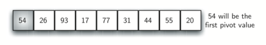
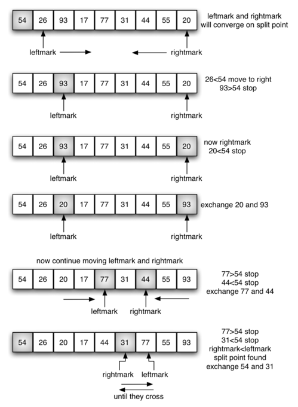
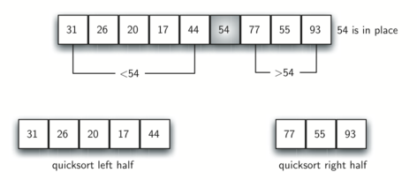

# Quick Sort - Breve explicação

O **quick sort** utiliza a estratégia de dividir para conquistar para obter as mesmas vantagens do merge sort, mas sem usar espaço adicional. Em compensação, é possível que a lista possa não ser dividida ao meio. Quando isso ocorre, veremos que seu desempenho é reduzido.

O quick sort primeiro seleciona um valor, chamado de **pivô**. Embora existam muitas maneiras de selecionar o pivô, iremos utilizar simplesmente o primeiro item na lista. O papel do pivô é ajudar na divisão da lista. A posição à qual o pivô pertence de fato na lista ordenada, conhecida como ponto de divisão, será usada para quebrar a lista em chamadas subsequentes do quick sort.

A *Figura 1* mostra que o 54 funcionará como nosso primeiro pivô. O 54 acabará na posição em que está o 31 na lista. O processo de partição ocorrerá em seguida. Ele irá encontrar o ponto de divisão e, ao mesmo tempo, moverá os itens para o lado apropriado da lista, isto é, maior ou menor que o valor do pivô.

<figure>
  
  <figcaption>Figura 1: O Primeiro Pivô do Quick Sort</figcaption>
</figure>

  O particionamento começa localizando dois marcadores de posição — vamos chamá-los de `leftmark` e `rightmark` — no começo e no fim dos demais itens da lista (posições 1 e 8 em *Figura 2*). O objetivo do processo de particionamento é mover os itens que estão do lado errado do pivô para o lado certo, convergindo para o ponto de divisão. A *Figura 2* mostra esse processo conforme nós localizamos a posição do número 54.

<figure>
  
  <figcaption>Figura 2: Encontrando o ponto de divisão para o 54</figcaption>
</figure>

  Começamos incrementando o `leftmark` até encontrarmos um valor que seja maior que o valor do pivô. Nós então decrementamos o `rightmark` até que encontremos um valor que seja menor que o valor do pivô. Nesse momento, descobrimos dois itens que estão fora de ordem em relação ao eventual ponto de divisão. Para o nosso exemplo, isso ocorre com o **93** e o **20**. Agora podemos trocar esses dois itens e repetir o processo novamente.

No momento em que o `rightmark` se tornar menor que o `leftmark`, paramos. A posição do `rightmark` vira agora o **ponto de divisão**. O valor do pivô pode ser trocado com o que estiver no ponto de divisão e o valor do pivô estará agora em seu devido lugar (Figura 3). Além disso, todos os itens à esquerda do ponto de divisão são menores do que o valor do pivô e todos os itens à direita do ponto de divisão são maiores do que o valor do pivô. A lista pode agora ser dividida no ponto de divisão e o quick sort pode ser chamado recursivamente sobre as duas metades.

<figure>
  
  <figcaption>Figura 3: Completando o Particionamento Para Encontrar o Ponto de Divisão do 54</figcaption>
</figure>

 Então, resumindo, os passos são:

- **Escolha do Pivô:** Pode ser o primeiro, último, meio ou um elemento aleatório do array.

- **Particionamento:** Reorganiza o array para que:

  - Elementos menores que o pivô fiquem à esquerda.

  - Elementos maiores que o pivô fiquem à direita.

  - O pivô fica em sua posição correta após essa etapa.

- **Recursão:** Repete o processo para as sublistas à esquerda e direita do pivô.

## Funcionamento

A animação abaixo mostra o `quickSort` em ação.

## Vantagens e Desvantagens

| **Vantagens**                                             | **Desvantagens**                                                                 |
|-----------------------------------------------------------|----------------------------------------------------------------------------------|
| ✔ Alta performance em média: complexidade de O(n log n).  | ✖ Pior caso de O(n²) quando o pivô é mal escolhido.                             |
| ✔ In-place: requer pouca memória adicional.               | ✖ Não é estável: pode modificar a ordem relativa de elementos iguais.           |
| ✔ Muito eficiente para grandes volumes de dados.          | ✖ Sensível à escolha do pivô, o que pode afetar significativamente o desempenho.|

## Desempenho

- **Melhor Caso:** O(n log n) (quando o pivô divide o array ao meio).

- **Pior Caso:** O(n²) (quando o pivô é o menor/maior elemento).

- **Caso Médio:** O(n log n).

## Quando Usar?

- Listas grandes onde velocidade é crítica.

- Ambientes com restrição de memória (in-place).

- Quando a estabilidade não é requisito.

>Para evitar o pior caso, use versões modificadas como Quick Sort com pivô aleatório ou Introsort (combina Quick Sort com Heap Sort).

## Referências

[Quick Sort - Wikipédia](https://pt.wikipedia.org/wiki/Quicksort)
[Quick Sort - USP](https://panda.ime.usp.br/panda/static/pythonds_pt/05-OrdenacaoBusca/OQuickSort.html#o-quick-sort)
