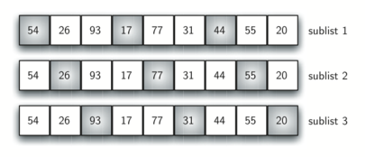

# Shell Sort - Breve explicação

O **shell sort**, às vezes chamaado de “ordenação por incrementos diminutos”, melhora a ordenação por inserção ao quebrar a lista original em um número menor de sublistas, as quais são ordenadas usando a ordenação por inserção. A forma única como essas sublistas são escolhidas é a chave para o shell sort. Em vez de quebrar a lista em sublistas de itens contíguos, o shell sort usa um incremento `i`, às vezes chamado de **gap**, para criar uma sublista escolhendo todos os itens que estão afastados `i` itens uns dos outros.

Isso pode ser visto na Figura 1. Essa lista tem nove itens. Se usarmos um incremento de três, serão três sublistas, cada uma sendo submetida à ordenação por inserção. Depois de realizado esse processo, ficamos com a lista mostrada em Figura 2. Embora essa lista não esteja completamente ordenada, algo muito interessante aconteceu. Ao ordenarmos as sublistas, os itens ficaram mais próximos de onde eles pertencem de fato.

<figure>
  
  <figcaption>Figura 1 – Shell Sort com Incremento de Três</figcaption>
</figure>  

 <figure>
  
  <figcaption>Figura 2 – Shell Sort depois de Ordenar Cada Sublista</figcaption>
</figure>  

 A Figura 3 mostra uma ordenação por inserção final usando um incremento de um; em outras palavras, uma ordenação por inserção convencional. Observe que ao realizar as ordenações de sublistas anteriores, reduzimos agora o número total de operações de deslocalmento necessárias para colocar a lista na sua ordem final. Nesse caso, precisamos de apenas mais quatro deslocamentos para completar o processo.

 <figure>
  
  <figcaption>Figura 3 – Uma Inserção Final Com Incremento de 1</figcaption>
</figure>  

 Então, resumindo:

- Ele divide a lista em sublistas menores usando um intervalo (gap).

- Ordena cada sublista com Insertion Sort.

- Reduz progressivamente o gap até chegar a 1 (equivalente ao Insertion Sort puro).

Escolha do Gap:

- A sequência de gaps é crucial para o desempenho do algoritmo. Uma sequência de gaps bem escolhida pode reduzir significativamente o tempo de ordenação, enquanto uma sequência menos eficaz pode levar a um comportamento quadrático, como no Insertion Sort.  (ex: sequência de Knuth: 1, 4, 13, 40, ...).

- Neste exemplo, usamos gap = tamanho / 2 e reduzimos pela metade a cada iteração.

## Funcionamento

A animação abaixo mostra o `shellSort` em ação.

## Vantagens e Desvantagens

| Vantagens                                           | Desvantagens                                            |
|-----------------------------------------------------|---------------------------------------------------------|
| ✔ Mais eficiente que Insertion Sort para listas médias. | ✖ Complexidade depende da sequência de *gaps*.         |
| ✔ In-place (não usa memória extra).                | ✖ Não é estável (pode alterar ordem de elementos iguais). |
| ✔ Bom para datasets até ~10.000 elementos.         | ✖ Menos intuitivo que outros algoritmos.                |

## Desempenho

- **Melhor Caso:** O(n log n) (com gaps ótimos).

- **Pior Caso:** O(n²) (com gaps inadequados).

- **Caso Médio:** O(n^(3/2)) para a sequência de Shell original.

## Quando Usar?

- Listas de tamanho médio (até ~10k elementos).

- Quando memória é limitada (in-place).

- Como alternativa ao Insertion Sort para ganho de performance.

## Referências

[Shell Sort - USP](https://panda.ime.usp.br/panda/static/pythonds_pt/05-OrdenacaoBusca/OShellSort.html)
